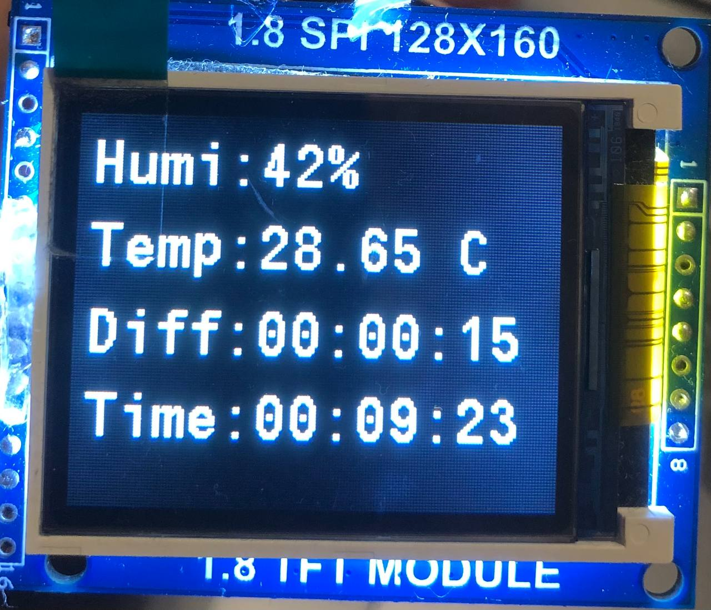

# STM32MonitorsTimer
Special work timer with temperature and humidity sensor

Timer calculate time, when it power on. You can reset your time on a PC put a finger on the timer (optotransistor)

Diff - menas time without pause, which you spend on a PC.

